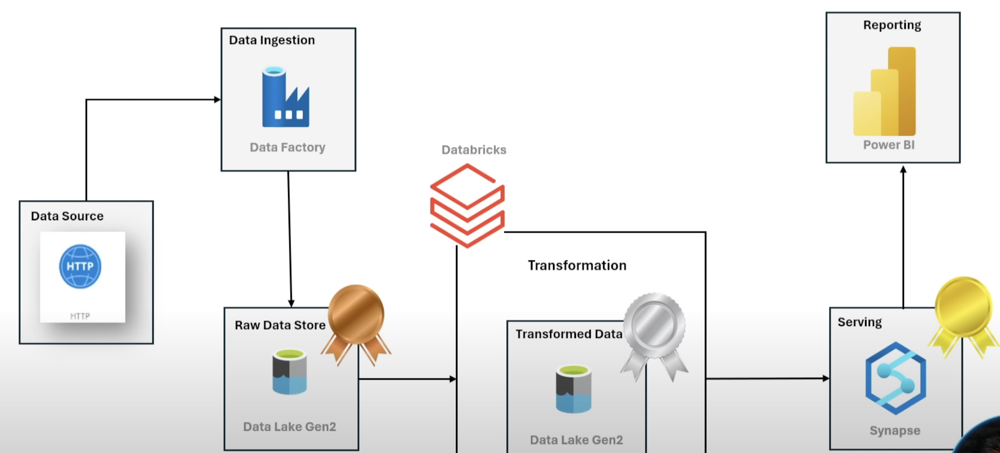
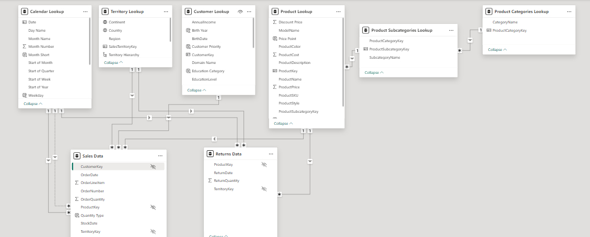
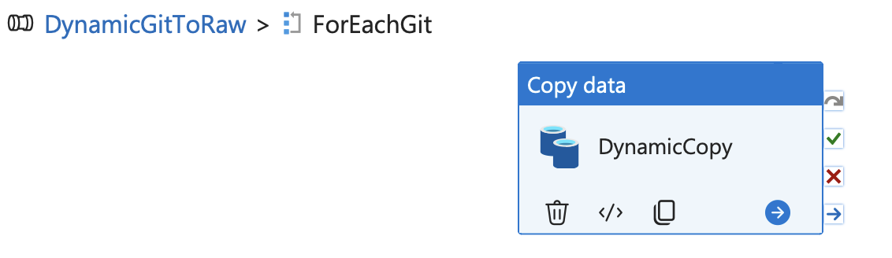
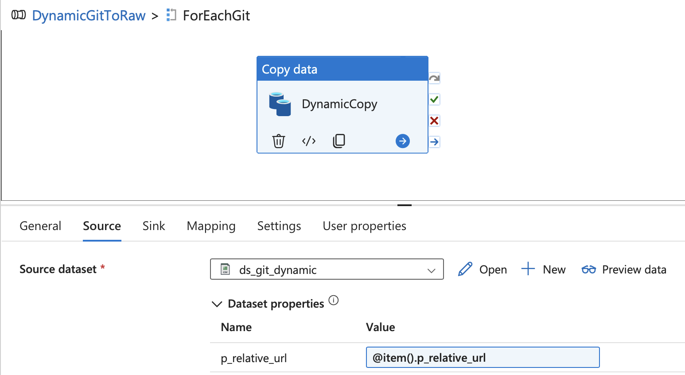
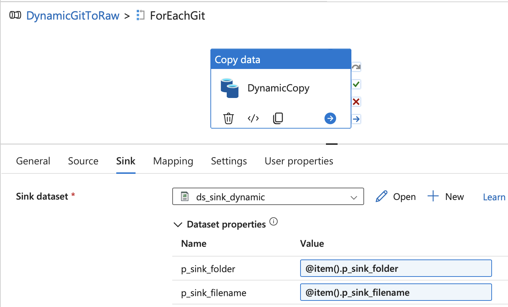
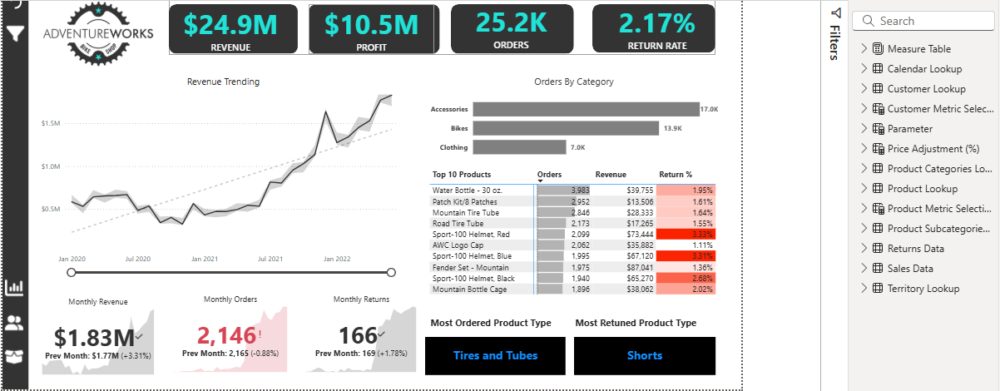
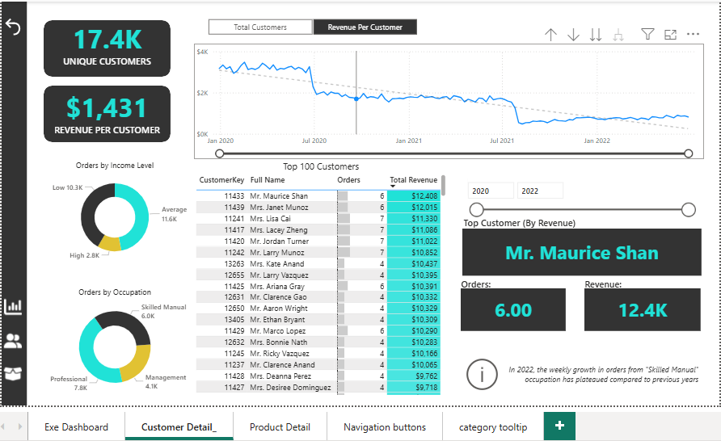
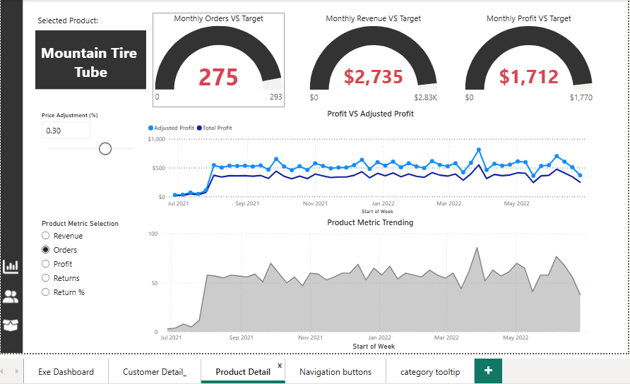

# AdventureWorks — Azure Data Engineering Project

> End-to-end demo of an Azure **medallion** data platform: ingest (ADF/HTTP ➜ ADLS Gen2 **Bronze**), transform (Databricks ➜ ADLS Gen2 **Silver**), serve (Synapse **Gold**), and report (Power BI).

---

## 🔎 Project Overview

This repository showcases a reproducible data engineering pipeline built on Azure.  
It ingests AdventureWorks sample data from HTTP sources, lands it in an Azure Data Lake, transforms it with Databricks, models it for analytics in Synapse, and publishes dashboards in Power BI.

---

## 🧱 Architecture

## Architecture

| Stage                | Service             | Layer  | Purpose                                          |
|----------------------|--------------------|--------|--------------------------------------------------|
| **Data Source**       | HTTP                | –      | AdventureWorks CSVs                              |
| **Ingestion**         | Azure Data Factory  | –      | Pull data from HTTP into ADLS Gen2 (raw)         |
| **Raw Store (Bronze)**| Azure Data Lake Gen2| Bronze | Landing area, unprocessed data                   |
| **Transformation**    | Azure Databricks    | Silver | Clean and model raw data into curated tables     |
| **Serving**           | Azure Synapse       | Gold   | Star schema for analytics and BI                 |
| **Reporting**         | Power BI            | –      | Dashboards and KPIs                              |

---

## 📦 Dataset Overview

### Fact tables
- **Sales (2015/2016/2017)**  
  Columns: `OrderDate`, `StockDate`, `OrderNumber`, `ProductKey`, `CustomerKey`, `TerritoryKey`, `OrderLineItem`, `OrderQuantity`
- **Returns**  
  Columns: `ReturnDate`, `TerritoryKey`, `ProductKey`, `ReturnQuantity`

### Dimension tables
- **Products**  
  Columns: `ProductKey`, `ProductSubcategoryKey`, `ProductSKU`, `ProductName`, `ModelName`, `ProductDescription`, `ProductColor`, `ProductSize`, `ProductStyle`, `ProductCost`, `ProductPrice`
- **Product Subcategories**  
  Columns: `ProductSubcategoryKey`, `SubcategoryName`, `ProductCategoryKey`
- **Product Categories**  
  Columns: `ProductCategoryKey`, `CategoryName`
- **Customers**  
  Columns: `CustomerKey`, `Prefix`, `FirstName`, `LastName`, `BirthDate`, `MaritalStatus`, `Gender`, `EmailAddress`, `AnnualIncome`, `TotalChildren`, `EducationLevel`, `Occupation`, `HomeOwner`
- **Territories**  
  Columns: `SalesTerritoryKey`, `Region`, `Country`, `Continent`
- **Calendar**  
  Columns: `Date`

---

## 📐 Power BI Data Model (Star Schema Implementation)

The Power BI model is a direct implementation of the **Star Schema** established in the **Gold Layer** (Azure Synapse). This structure is crucial for efficient query performance and accurate measure calculation (DAX).

The model features **two Fact tables** and **six Dimension (Lookup) tables**. All relationships are **One-to-Many (\(1:*\))** and flow from the Dimension tables to the Fact tables, which is the optimal design for analytical reports.

### Fact Tables (The 'What' and 'How Much')

| Table | Granularity | Key Relationships | Purpose |
| :--- | :--- | :--- | :--- |
| **Sales Data** | Order Line Item | Related to **Calendar**, **Product**, **Customer**, and **Territory** Lookups. | Contains transactional sales data (orders, revenue, quantity) necessary for calculating most KPIs, trends, and profitability metrics. |
| **Returns Data** | Product/Territory/Date | Related to **Calendar**, **Product**, and **Territory** Lookups. | Contains the volume and value of returned goods, essential for calculating the **Return Rate (%)** shown on the Executive Dashboard. |

### Dimension Tables (The 'Who', 'When', and 'Where')

| Table | Role in Analysis | Key Attributes | Insights Enabled |
| :--- | :--- | :--- | :--- |
| **Calendar Lookup** | Time Dimension | Day, Month Name, Year, Weekday, Start of Quarter, etc. | Allows for time-series analysis like **Revenue Trending** and year-over-year comparisons (e.g., in the Revenue Trending chart). |
| **Customer Lookup** | Customer Demographics | Annual Income, Occupation, Gender, Education Level. | Enables detailed segmentation for the **Customer Dashboard**, driving insights like *Orders by Income Level* and *Top 10 Customers*. |
| **Territory Lookup** | Geographic Dimension | Continent, Country, Region. | Facilitates geographical filtering and analysis, allowing executives to assess performance by **Continent** (as seen in the filter pane). |
| **Product Lookup** | Product Attributes | Product Name, Model Name, Color, Cost, Price. | Central dimension for all product-related dashboards, enabling drill-through functionality and the **Adjusted Profit** parameter calculation. |
| **Product Subcategories Lookup** | Product Hierarchy (Level 2) | Subcategory Name | Connects products to their categories, enabling the *Orders by Category* analysis on the Executive Dashboard. |
| **Product Categories Lookup** | Product Hierarchy (Level 1) | Category Name | Top-level grouping used for high-level aggregations (e.g., Bikes, Accessories). |

> 🔑 **Modeling Integrity:** The **one-to-many** relationship structure ensures that attributes selected from any dimension table (e.g., 'Continent' from *Territory Lookup*) correctly filter the measure calculations in the fact tables (*Sales Data* and *Returns Data*), resulting in accurate report visualizations.

---

---

## 🧭 Medallion Plan

- **Bronze (Raw):** Store CSVs exactly as received in ADLS Gen2.  
- **Silver (Transformed):** Enforce schema & types, add date parts, validate foreign keys.  
- **Gold (Serving):** Star schema in Synapse for Power BI.

---

## 🛠️ Tech Stack

- **Azure Data Factory** — ingestion (HTTP → ADLS Gen2 Bronze)  
- **Azure Databricks** — PySpark transformations (Bronze → Silver)  
- **Azure Synapse** — serving layer (Gold)  
- **Power BI** — dashboards & reporting  
- **ADLS Gen2** — data lake storage  

---

## ⚙️ Step-by-Step Implementation  

### 1. Resource Setup  
- **Create Resource Group** – logical container for all resources.  
- **Create Storage Account (Resource 1)** – use **Locally Redundant Storage (LRS)**.  
- **Enable Hierarchical Namespace** – converts blob storage into **Data Lake Gen2** (required for folder-like structures and table storage).  
- **Create Azure Data Factory (Resource 2)** – for data ingestion pipelines.  
- **Define Medallion Containers** – within the Data Lake, create three containers:  
  - `bronze` → raw, unprocessed data  
  - `silver` → transformed, curated data  
  - `gold` → serving layer for analytics  

---

### 2. Data Ingestion (ADF → Bronze)  
- Use **Azure Data Factory Pipelines** to ingest data from GitHub (source) into ADLS Gen2 (destination).  
- Required **Linked Services**:  
  - **HTTP** (base URL from GitHub)  
  - **Azure Data Lake Gen2** (destination)  
- **Pipeline Activities**:  
  1. **Copy Activity** → moves data from HTTP source to ADLS Gen2 Bronze container.  
  2. **Source Configuration** → specify the relative URL of the raw CSV.  
  3. **Sink Configuration** → map to Bronze container in ADLS Gen2.  

---

### 3. Static vs. Dynamic Pipelines  
- **Static Pipeline:** Current setup ingests a single file at a time.  
- **Dynamic Pipeline (Recommended in Real Projects):**  
  - Uses **Iteration & Conditionals** (e.g., *For Each* activity).  
  - Dynamically parameterizes file names/paths.  
  - Enables ingestion of multiple files in a single automated pipeline run.  

---

### 4. Creating Dynamic Pipelines in ADF  

To make ingestion scalable across multiple files without hardcoding:  

1. **Parameterization**  
   - Create **one parameter** for the HTTP source file (CSV).  
   - For the ADLS Gen2 sink, define **two parameters**: one for the folder (directory) and one for the file.  
   - In total, you will use **3 parameters** (1 source + 2 sink).  

2. **For Each Activity**  
   - Add a loop (`ForEach`) to iterate through files in your GitHub repo.  
   - The iteration list comes from a **JSON array/dictionary** of relative file URLs and dataset metadata.  

3. **Lookup Activity**  
   - Use a **Lookup activity** to read the JSON file that contains the dataset specifications.  
   - The `ForEach` activity references this Lookup output and passes values into parameters.  

4. **Embedding the Copy Activity**  
   - Place the **Dynamic Copy activity** inside the `ForEach`.  
   - This way, each iteration dynamically pulls the right file from GitHub and lands it in the correct ADLS Gen2 folder.  

📌 *Tip:* This approach lets you add new CSVs to your JSON spec without modifying the pipeline itself—making it extensible and production-friendly.  
📸 Add supporting screenshots 

## 📸 Embedding DynamicCopy & Parameters in ForEach Activity

**1. Embedding DynamicCopy into ForEach activity**  

**2. Embedding Parameters within ForEach as Source**  

**3. Embedding Parameters within ForEach as Sink/Destination**  

---

✅ With this, **Phase 1 (Bronze layer)** is complete.  
Next, we move into **Phase 2 (Silver layer)**, where transformations are performed using **Azure Databricks**.  

---

### 5. Silver Phase — Transformation with Azure Databricks  

After completing the Bronze ingestion, the next step is to clean and transform the data in **Azure Databricks**.  

- **Databricks Setup**  
  - Create a compute cluster within Azure Databricks.  
  - Connect Databricks Notebooks to **Azure Data Factory (ADF)**.  
  - Note: This requires credentials and secure communication between Databricks and ADF.  

- **Authentication & Access**  
  1. Create a **Microsoft Entra ID key (certificate)** that holds the authentication credentials.  
  2. Generate a **secret/key** for your Entra ID.  
  3. Assign the role **Storage Blob Contributor** to your storage account in Azure.  

- **Data Loading**  
  - Use official Databricks documentation to load data from ADLS Gen2 into Databricks.  
  - Perform schema enforcement, cleansing, and enrichment.  
  - Add date parts, enforce data types, and validate relationships.  

- **Data Writing**  
  - Save transformed datasets in **Parquet** format into the **Silver container** in ADLS Gen2.  
  - Once all files are transformed and saved, your Silver layer is complete.  

> 📓 *Refer to the provided `.ipynb` notebooks for transformation code.  
> Advanced transformations and business rules are further handled in **Power BI** using Table View and **DAX** for flexible analysis and visualization.*  

---

### 6. Gold Phase — Serving with Azure Synapse  

The **Gold Layer** is the serving/consumption layer. Here, curated and business-ready datasets are exposed to BI tools and end-users.  

**Step 1: Synapse Setup**  
- Create an **Azure Synapse Analytics workspace**.  
- Configure a **serverless SQL database**.  

**Step 2: Permissions**  
- Assign **Storage Blob Contributor** role to Synapse and your user identity.  

**Step 3: Query Silver Data**  
- Use **`OPENROWSET()`** to query curated data directly from ADLS Silver.  
- This allows schema validation and lightweight exploration before publishing.  

**Step 4: Create Views**  
- Build logical **views** for each Silver dataset (Sales, Customers, Products, Territories, Returns, Calendar, etc.).  

**Step 5: Create External Tables**  
- Define:  
  - **Credentials** (managed identity or keys).  
  - **External Data Sources** (point to Silver and Gold containers).  
  - **External File Formats** (Parquet, CSV, JSON, with compression).  
- Promote datasets into **external tables** aligned with fact and dimension roles.  

**Step 6: Data Modeling**  
- Organize into a **star schema** with fact tables (Sales, Returns) and dimension tables (Products, Customers, Territories, Calendar, Product Subcategories).  
- Optimize with partitioning/indexing for efficient queries.  

**Step 7: Consumption**  
- Power BI connects to Synapse Gold tables for dashboards and KPIs.  

**References:**  
- [Create Database Master Key](https://learn.microsoft.com/en-us/sql/t-sql/statements/create-master-key-transact-sql?view=sql-server-ver17)  
- [Create Database Scoped Credential](https://learn.microsoft.com/en-us/sql/t-sql/statements/create-database-scoped-credential-transact-sql?view=sql-server-ver17)  
- [Create External File Format](https://learn.microsoft.com/en-us/sql/t-sql/statements/create-external-file-format-transact-sql?view=sql-server-ver17&tabs=delimited)  

---

## 🔄 Medallion Workflow Recap  

1. **Bronze Layer (Raw Store):**  
   - Direct ingestion from GitHub into ADLS Gen2.  
   - Stores CSVs in raw, unmodified form.  

2. **Silver Layer (Transformation):**  
   - Databricks cleans, validates schema, and enriches the data.  
   - Adds date parts, enforces types, ensures referential integrity.  

3. **Gold Layer (Serving):**  
   - Curated star schema tables published into Synapse.  
   - Optimized for BI consumption.  

---

## 📊 Power BI Dashboards — Insights and Flexibility

The final layer of the data platform is a Power BI report that connects to the curated **Gold Layer** in Azure Synapse, structured around three interactive dashboards.

### **1. Executive Dashboard (Exe Dashboard)** 📈

This dashboard provides a high-level summary of the entire business, focusing on key performance indicators (KPIs) and top-level trends.

| Key Insight | Metric/Component | Actionable Focus |
| :--- | :--- | :--- |
| **Overall Performance** | **Top Card Metrics** ($24.9M Revenue, 2.17% Return Rate) | Maintain profitability while closely monitoring the return rate to ensure quality control processes are effective. |
| **Growth Trajectory** | **Revenue Trending** | Analyze the consistent growth from 2021 into 2022 to replicate successful strategies (e.g., marketing campaigns, product launches). |
| **Product Dominance** | **Orders by Category** (**Accessories** and **Bikes** are dominant) | Allocate advertising and inventory resources to these high-volume categories, while investigating strategies to boost sales in lower-performing categories. |
| **High Return Risk** | **Most Returned Product Type** (**Shorts**) | Use the drill-through feature to investigate top returning products, focusing on supply chain or quality issues specific to this product line. |
| **Focus on Top Performers** | **Top 10 Products** | Use the **Drill-Through** to immediately deep-dive into the profitability and pricing strategy of the top revenue and order drivers. |

**Power BI Screenshot: Executive Dashboard**

---

### **2. Customer Dashboard** 👤

This dashboard focuses on understanding customer value, behavior, and demographics, utilizing a parameter to switch the primary metric for detailed analysis.

| Key Insight | Metric/Component | Actionable Focus |
| :--- | :--- | :--- |
| **Customer Segmentation** | **Orders by Income Level** (**Average** income drives most orders) | Develop targeted marketing campaigns for the high-volume Average income segment while launching premium offerings to boost the lower-volume **High** income segment. |
| **Professional Focus** | **Orders by Occupation** (**Skilled Manual/Professional** are largest) | Tailor product messaging and channel presence to align with the habits and needs of these core professional groups. |
| **High Value Identification** | **Top 10 Customers** (e.g., Mr. Maurice Shan) | Implement a customer loyalty or VIP program for these high-revenue patrons to ensure retention and maximize lifetime value. |
| **Flexible Valuation** | **Parameter Control** (Revenue Per Customer OR Total Customers) | Strategists can use the parameter to shift focus from sheer volume (Total Customers) to high-margin behavior (Revenue Per Customer) for more nuanced goal setting. |

**Power BI Screenshot: Customer Dashboard**

---

### **3. Product Dashboard** ⚙️

This dashboard provides a deep-dive, granular analysis of a **selected product** and features **two interactive parameters** for strategic planning and forecasting.

| Key Insight | Metric/Component | Actionable Focus |
| :--- | :--- | :--- |
| **Target Monitoring** | **Monthly Targets (Orders, Revenue, Profit)** | Instantly assess if the selected product is on track for current month goals. If the product is underperforming, immediate inventory or promotional adjustments are needed. |
| **Pricing Strategy** | **Price Adjustment Parameter (Adjusted Pricing)** | Utilize this parameter to model the impact of a price change (e.g., a 10% increase) on the **Adjusted Profit** line. This provides a risk-free environment for testing pricing elasticity. |
| **Performance Trending** | **Metric Selection Parameter (Personal Metric Selection)** | Switch the time-series view to analyze specific risks (e.g., trending *Returns*) or successes (e.g., trending *Profit*). This facilitates quick root-cause analysis for specific product issues. |
| **Drill-Through Efficiency** | **Source from Executive Dashboard** | The direct link allows managers to transition from identifying a product that needs attention (Executive view) to immediately seeing its granular performance and future pricing potential (Product view). |

**Power BI Screenshot: Product Dashboard**

---

## 🔗 Interactive Features

### **Drill-Through Functionality** 🖱️

The report incorporates an essential **Drill-Through** feature for seamless navigation:

* **Executive to Product Detail:** Clicking on any product within the **Top 10 Products** table on the **Executive Dashboard** directly navigates the user to the **Product Dashboard**.
* The **Product Dashboard** is automatically filtered to show the specific details of the product selected, allowing for a rapid deep-dive investigation of performance anomalies or successes.

---

## 🚀 Roadmap (initial)

- [x] Defined resource setup (RG, ADLS, ADF)
- [x] Bronze ingestion pipeline created (static)
- [x] Bronze ingestion pipeline upgraded (dynamic with parameters + ForEach)
- [x] Databricks notebooks for Silver transformations
- [x] Synapse schema deployment (Gold)
- [x] Power BI dashboard integration
- [x] **Power BI Drill-Through implemented (Executive ➡️ Product)**
- [x] **Power BI Parameters implemented (Customer & Product Dashboards)**

---

## 🔭 Actionable Insights and Future Focus

Based on the current data model and Power BI capabilities, here are the key areas for action and future development:

### 💡 Actionable Insights from Current Data

1.  **High-Value Customer Retention:** Focus marketing efforts on the **Top 10 Customers** identified in the Customer Dashboard. The highest revenue per customer comes from the **Professional** and **Skilled Manual** occupations, suggesting targeted outreach to these segments would yield the highest return.
2.  **Product Quality Review:** The Executive Dashboard flags **"Shorts"** as the Most Returned Product Type. This requires immediate investigation (using the drill-through to the Product Dashboard) to determine if a specific size, model, or quality issue is driving the high return rate.
3.  **Dynamic Pricing Modeling:** Utilize the **Price Adjustment** parameter on the Product Dashboard extensively. Management should model a few price change scenarios for the **Top 10 Products** to determine optimal pricing that maximizes **Adjusted Profit** without severely impacting order volume.

### ⚙️ Future Engineering Focus

1.  **Data Latency Reduction:** Currently, the pipeline stages (ADF, Databricks, Synapse) are executed sequentially. Future improvements should explore using **Azure Stream Analytics** or **Databricks Delta Live Tables (DLT)** for incremental loading and near real-time updates to the Silver and Gold layers, reducing dashboard latency.
2.  **Sales Forecasting Integration:** Integrate an **Azure Machine Learning** service into the pipeline that feeds a *Fact_Forecast* table into the Gold layer. This would allow the Power BI report to include **Predictive Analytics** visualizations alongside historical and current performance.
3.  **Data Quality Monitoring:** Implement specific **data quality checks** within the Silver transformation layer (Databricks) to monitor for invalid foreign keys, missing data, or schema drift. Results of these checks should be logged and surfaced in a dedicated Data Quality dashboard.

---

## 📄 License & Attribution

Dataset adapted from **AdventureWorks** sample data. Use for learning and portfolio purposes.

---
Contains files for personal projects
